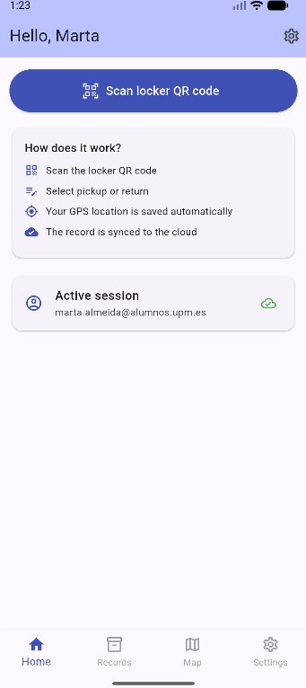
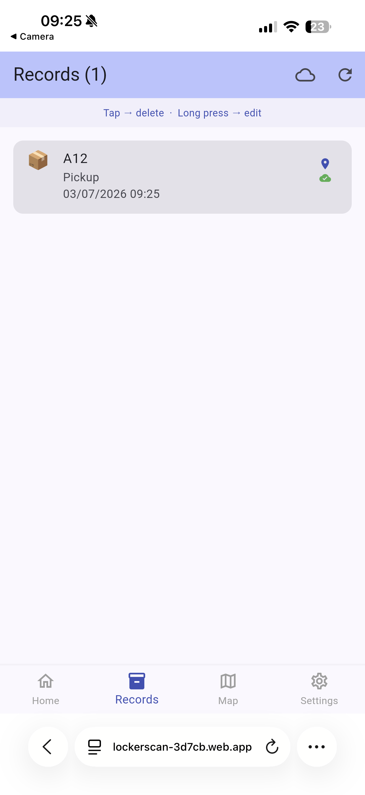
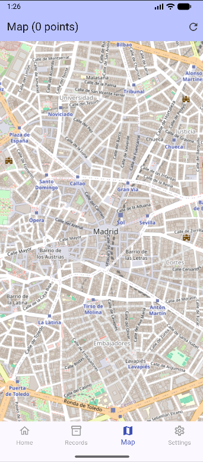
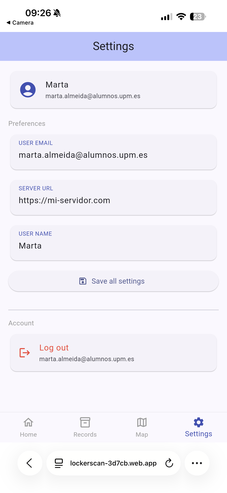

# LockerScan

## Workspace

Github:
- Repository: https://github.com/marta-almeida-bt0122/MADFlutter
- Releases: https://github.com/marta-almeida-bt0122/MADFlutter/releases

Workspace: https://upm365.sharepoint.com/sites/MobileAppDevelopment41

## Description

LockerScan is a Flutter-based mobile application designed to manage locker access through QR code scanning. Users authenticate with their credentials, scan the QR code attached to a locker door, and register whether they are picking up or returning an item, along with the reason for the action. Each record is stored locally on the device and synchronized in real time to the cloud via Firebase, making the history accessible from any device.

Compared to existing locker management systems — which are typically web-only, require physical key cards, or rely on manual paper logs — LockerScan offers a fully mobile, contactless experience. Unlike generic inventory apps such as Sortly or MyStuff2, LockerScan is specifically designed for locker access control with GPS-based location tracking and cloud synchronization per user account.

## Screenshots and navigation

| Home | Records | Map | Settings |
|------|---------|-----|----------|
|  |  |  |  |

## Demo Video

https://upm365-my.sharepoint.com/:v:/g/personal/marta_almeida_alumnos_upm_es/IQAmlC_NPg8CTrWTahcByvfxAWp9thq4b7Q6vtXjMi_GvN4?nav=eyJyZWZlcnJhbEluZm8iOnsicmVmZXJyYWxBcHAiOiJPbmVEcml2ZUZvckJ1c2luZXNzIiwicmVmZXJyYWxBcHBQbGF0Zm9ybSI6IldlYiIsInJlZmVycmFsTW9kZSI6InZpZXciLCJyZWZlcnJhbFZpZXciOiJNeUZpbGVzTGlua0NvcHkifX0&e=5RWpSJ

## Features

**Functional features:**
- Scan a QR code attached to a locker door to identify it
- Register a pickup or return action with an optional reason
- View the full history of locker interactions in a list
- Visualize all scan locations on an interactive map
- Secure login and logout with email and password
- Settings screen to update user preferences

**Technical features:**
- Persistence in shared preferences — user name and app settings. Ref: `lib/screens/settings_screen.dart`
- Persistence in SQFLite local database — full CRUD on scan records. Ref: `lib/db/database_helper.dart`
- Firebase Realtime Database — cloud sync of records per authenticated user. Ref: `lib/screens/home_screen.dart`
- Firebase Authentication — email and password login/logout. Ref: `lib/screens/login_screen.dart`
- Maps: OpenStreetMap via flutter_map — markers loaded from local database. Ref: `lib/screens/map_screen.dart`
- QR Scanner: mobile_scanner package — cross-platform camera-based QR reading. Ref: `lib/screens/home_screen.dart`
- Sensors: GPS coordinates captured at the moment of each scan via Geolocator. Ref: `lib/models/scan_record.dart`
- Menu: BottomNavigationBar with 4 tabs (Home, Records, Map, Settings). Ref: `lib/screens/main_screen.dart`

## How to Use

1. Open the app — if you are not logged in, the login screen will appear
2. Enter your email and password and tap **Sign in**
3. On the Home screen, tap **Scan locker QR code** and point the camera at the QR code on the locker door
4. Select the action type (Pickup or Return) and enter a reason if required
5. Tap **Save** — the record is saved locally and synced to Firebase
6. Go to the **Records** tab to see your full history. Tap a record to delete it or long-press to edit the reason
7. Go to the **Map** tab to see where each scan took place
8. Go to **Settings** to update your preferences or log out

## Participants

- Marta Almeida Santiago (marta.almeida@alumnos.upm.es)
